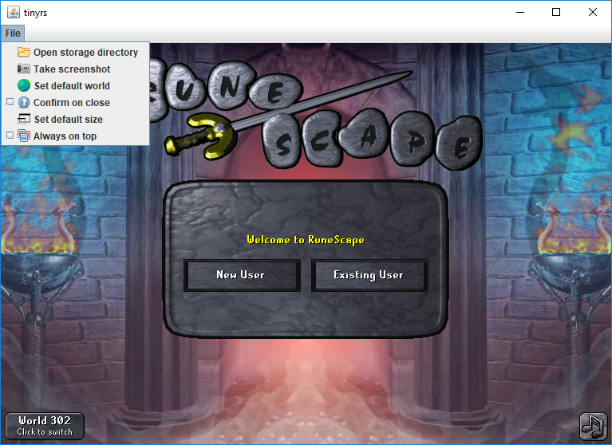

# tinyrs
A minimalistic game loader for Old School RuneScape.

## Features
- Super portable. One ~30 kB file is all you need! Ideal for people who use
  multiple computers.
- Cross-platform support. Should run on any platform that supports Java with
  Swing.
  - Tested on *Windows 10*, *OS X El Capitan (10.11.6)*, and *Ubuntu 17.04*.
- Gamepack caching and automatic updating. This ensures quick loading times,
  as the game client is only downloaded when a new version comes out.
- Built-in screenshot ability.

## Usage
- The easiest way to use this application is to download and run the executable
  **tinyrs.jar** in this repository. Alternatively, the more wary users can
  compile the project for themselves and run `Application.class`.
- Through the use of the command-line, two additional program arguments can be
  specified:
  - `defaultWorld`, which specifies the initial game world to connect to, and
  - `storageDirectory`, which overrides the default storage directory (which
    lies in the home directory).

### Dependencies
- Java 6
