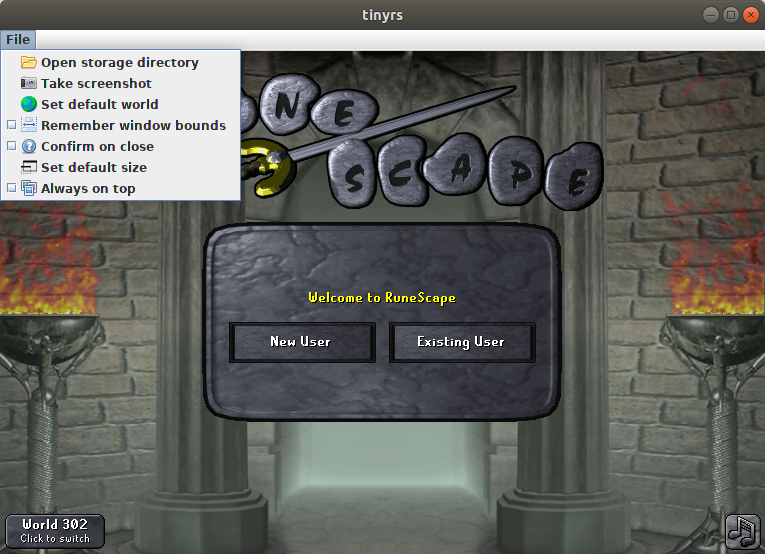

# tinyrs
A minimalistic game client for Old School RuneScape.

## Features
- Super portable. One ~60 kB file is all you need!
- Cross-platform support. Should run on any platform that supports Java with Swing.
  This is particularly useful on Linux, which (currently) does not have an official
  game client.
- Gamepack caching. This ensures quick start-up times, as the game client is only
  downloaded when a new version is released.
- Built-in screenshot ability.
- Plugin support (see below).

## Usage
The easiest way to use this application is to download and run **tinyrs.jar** in this
repository. Alternatively, the more wary users can compile the project for themselves
and run `tinyrs.Application`.

Through the use of the command-line, three additional program arguments can be specified:

  - `defaultWorld`, which specifies the initial game world to connect to, and
  - `storageDirectory`, which overrides the default storage directory (which
    lies in the home directory), and
  - `pluginArchive`, which specifies the path to a plugin JAR file; see **Plugins**.
    It can be specified multiple times.

#### Plugins
Plugins are (small) programs that are loaded along with **tinyrs** that provide a new
feature or enhance an existing one. Each plugin needs to be packed in its own archive
(`.jar` file). The archive needs to contain two things to be considered a valid plugin:

 1. A `public`, concrete class that extends `tinyrs.plugin.Plugin` and has a nullary
    constructor.
 2. A manifest file with the attribute `Plugin-Class` which specifies the binary name
    of the class that extends `Plugin`.

Any plugins that have been specified by command-line are loaded when **tinyrs** first
starts up. When the game client is loaded, every plugin is initialized then started,
one by one. If a plugin fails to initialize or start, it is simply ignored. If any
plugins have been successfully started, a "Plugins" menu will appear in the menu bar
which will contain an item corresponding to each plugin. This menu item can be used to
interact with the plugin while it is running. After a plugin stops running, the menu
item is disabled, which causes it to appear greyed out in the "Plugins" menu.

### Dependencies
- Java 6
